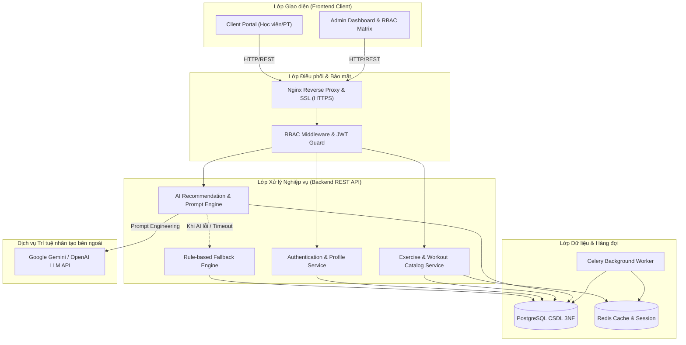

# HỆ THỐNG QUẢN LÝ PHÂN QUYỀN TÍCH HỢP AI HỖ TRỢ GỢI Ý BÀI TẬP GYM-YOGA
> **Đồ án môn học:** Quản lý dự án Công nghệ Thông tin (QLDACNTT)  
> **Nhóm thực hiện:** Nhóm 5 Người | **Thời gian:** 07/09/2026 – 26/10/2026 (8 Tuần - 4 Sprint)  
> **Mã nguồn:** Kế thừa & phát triển dựa trên nền tảng mã nguồn mở wger, tùy biến phân quyền RBAC đa vai trò và tích hợp AI Recommendation Engine.

---

<p align="center">
  
  
  
  
  
</p>

---

## 👥 THÀNH VIÊN ĐỘI NGŨ & PHÂN CÔNG VAI TRÒ (5 NGƯỜI)

| STT | Họ và tên | MSSV | Email liên hệ | Vai trò dự án | Trách nhiệm trọng tâm |
| :-: | :--- | :-: | :--- | :--- | :--- |
| 1 | **Nguyễn Phan Ngọc Trưởng** | 2380602415 | hnhoa494@gmail.com | **Project Manager (PM)** | Quản lý tiến độ, phạm vi, rủi ro, điều phối Sprint, tài liệu PMBOK. |
| 2 | **Lê Quốc Anh** | 2380600052 | lequocanh125@gmail.com | **Product Owner (PO/BA)** | Khảo sát thực tế, tài liệu SRS, 200 User Stories & Acceptance Criteria. |
| 3 | **Nguyễn Chí Nhân** | 2380601523 | chinhan15102005@gmail.com | **Frontend Developer (UI/UX)** | Thiết kế Figma, xây dựng giao diện Portal & Admin Dashboard, kết nối API. |
| 4 | **Bùi Nguyễn Công Nghiệp** | 2380601460 | buinguyencongnghiep04@gmail.com | **Backend & AI Developer** | Xây dựng RESTful API, Auth JWT, RBAC Middleware, tích hợp AI Gemini/OpenAI. |
| 5 | **Đỗ Minh Nhật** | 2380614792 | thcs.dominhnhat.lop9a1@gmail.com | **Database & QA/Tester** | Thiết kế ERD 3NF, migration, Master Test Plan, 150+ Test cases, E2E testing. |

---

## 🏗️ KIẾN TRÚC HỆ THỐNG (SYSTEM ARCHITECTURE)

Hệ thống được thiết kế theo mô hình phân tầng sạch (Clean Multi-tier Architecture):



---

## 🌿 QUY TRÌNH GITFLOW & HỆ THỐNG NHÁNH

Dự án áp dụng mô hình phân nhánh chuẩn GitFlow gồm 2 nhánh vĩnh cửu và 5 nhánh chuyên trách cho 5 vai trò:

* **`production`** *(hoặc `main`)*: Nhánh sản phẩm chính thức, ổn định tuyệt đối qua các mốc Milestone.
* **`develop`**: Nhánh tích hợp trung tâm của cả 5 thành viên. Mọi tính năng sau khi kiểm thử đạt chuẩn sẽ được tạo Pull Request merge vào đây.
* **5 Nhánh Vai trò (`role/*`):**
  * `role/pm`: Nguyễn Phan Ngọc Trưởng quản lý hồ sơ PMBOK, WBS, tiến độ.
  * `role/po`: Lê Quốc Anh quản lý yêu cầu, Product Backlog, SRS.
  * `role/frontend`: Nguyễn Chí Nhân phát triển mã nguồn UI/UX React.
  * `role/backend`: Bùi Nguyễn Công Nghiệp phát triển Django REST API & AI Engine.
  * `role/database-qa`: Đỗ Minh Nhật quản lý CSDL, migrations và bộ kiểm thử QA.

---

## 🗓️ TIẾN ĐỘ THỰC HIỆN 8 TUẦN (AGILE ROADMAP)

| Tuần | Giai đoạn / Sprint | Thời gian | Trọng tâm công việc | Trạng thái |
| :-: | :--- | :-: | :--- | :-: |
| **Tuần 1** | **Sprint 1: Khởi động & Khảo sát** | 07/09 – 13/09/2026 | Project Charter, Scope Statement, WBS, RACI, khảo sát Gym/Yoga & SRS. | ✅ **Hoàn thành** |
| **Tuần 2** | **Sprint 1: Phân tích & Thiết kế** | 14/09 – 20/09/2026 | 200 User Stories, sơ đồ Use Case, ERD 3NF, bản vẽ UI Figma & Prototype. | ✅ **Hoàn thành** |
| **Tuần 3** | **Sprint 2: Nền tảng & Xác thực** | 21/09 – 27/09/2026 | Khởi tạo GitFlow, Docker, Database, JWT Auth, Profile thể trạng, tính BMI. | 🔄 **Đang thực hiện** |
| **Tuần 4** | **Sprint 2: Quản lý Phân quyền RBAC** | 28/09 – 04/10/2026 | RBAC Middleware, API phân quyền, Admin Dashboard, RBAC Test Cases. | ⏳ Chờ thực hiện |
| **Tuần 5** | **Sprint 3: Quản lý Bài tập Gym/Yoga** | 05/10 – 11/10/2026 | CRUD bài tập, bộ lọc đa tiêu chí (cơ, độ khó), đánh giá & rating bài tập. | ⏳ Chờ thực hiện |
| **Tuần 6** | **Sprint 3: Tích hợp Trí tuệ nhân tạo (AI)**| 12/10 – 18/10/2026 | AI API (Gemini/OpenAI), Prompt Engineering, AI Wizard, Fallback Engine. | ⏳ Chờ thực hiện |
| **Tuần 7** | **Sprint 4: Tích hợp toàn diện & Test** | 19/10 – 25/10/2026 | Kiểm thử E2E, bảo mật RBAC, triển khai máy chủ Cloud VPS, fix bug. | ⏳ Chờ thực hiện |
| **Tuần 8** | **Sprint 4: Nghiệm thu & Bàn giao** | 26/10/2026 | Kiểm thử hồi quy, hoàn thiện User Manual, quay Video Demo & Slide bảo vệ. | ⏳ Chờ thực hiện |

---

## 📂 DANH MỤC HỒ SƠ TÀI LIỆU DỰ ÁN

Toàn bộ tài liệu được số hóa và chuẩn hóa trong thư mục [`docs/`](file:///home/chinhan/docs):
* [`docs/01_Project_Charter_Ton_Chi_Du_An.md`](file:///home/chinhan/docs/01_Project_Charter_Ton_Chi_Du_An.md): Tôn chỉ dự án, ngân sách 90tr, mục tiêu.
* [`docs/02_Scope_Statement_Pham_Vi.md`](file:///home/chinhan/docs/02_Scope_Statement_Pham_Vi.md): Báo cáo phát biểu phạm vi trong và ngoài dự án.
* [`docs/03_WBS_Tu_Dien_va_Ma_Tran_RACI.md`](file:///home/chinhan/docs/03_WBS_Tu_Dien_va_Ma_Tran_RACI.md): Cấu trúc phân rã công việc WBS 6 nhóm và ma trận RACI.
* [`docs/04_Product_Backlog_200_Issues.md`](file:///home/chinhan/docs/04_Product_Backlog_200_Issues.md): **Bộ 200 Issues chuẩn hóa** đầy đủ tiêu chí nghiệm thu (Acceptance Criteria).
* [`docs/05_Master_Test_Plan_va_ERD.md`](file:///home/chinhan/docs/05_Master_Test_Plan_va_ERD.md): Mô hình ERD chuẩn 3NF và kế hoạch kiểm thử Master Test Plan.
* [`docs/06_GitFlow_va_Quy_Che_Lam_Viec.md`](file:///home/chinhan/docs/06_GitFlow_va_Quy_Che_Lam_Viec.md): Quy ước commit và quy chế làm việc nhóm.

---

## 🚀 HƯỚNG DẪN KHỞI CHẠY HỆ THỐNG

### 1. Khởi chạy với Docker Compose (Khuyến nghị)
```bash
# Clone repository về máy
git clone https://github.com/aoi0701/nhom5nguoi__QLDACNTT__Gym-Yoga.git
cd nhom5nguoi__QLDACNTT__Gym-Yoga

# Khởi chạy toàn bộ hệ thống (Database, Backend, Frontend)
docker-compose up -d --build
```

### 2. Truy cập các dịch vụ
* **Frontend Portal:** `http://localhost:5173`
* **Backend REST API:** `http://localhost:8000/api/v2`
* **Swagger API Documentation:** `http://localhost:8000/api/schema/swagger-ui/`
* **Admin Dashboard:** `http://localhost:5173/admin`
