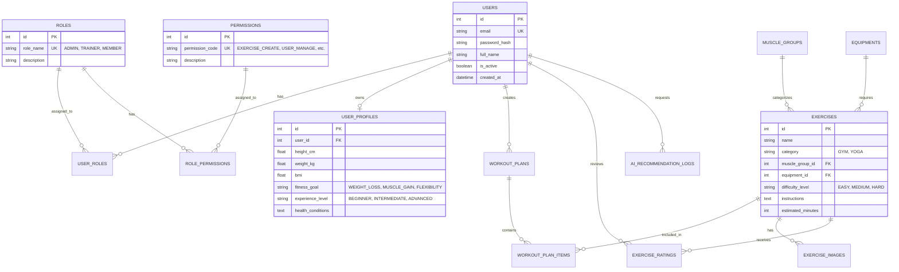

# MASTER TEST PLAN & THIẾT KẾ CSDL QUAN HỆ (ERD 3NF)

> **Người lập:** Đỗ Minh Nhật (Database Engineer & Lead QA/Tester)  
> **Phê duyệt:** Nguyễn Phan Ngọc Trưởng (PM) & Lê Quốc Anh (PO)  

---

## 1. MÔ HÌNH THỰC THỂ QUAN HỆ (ERD 3NF)

---

## 2. KẾ HOẠCH KIỂM THỬ MASTER TEST PLAN

### 2.1 Phạm vi kiểm thử
1. **Kiểm thử chức năng (Functional Testing):**
   * Đăng ký, Đăng nhập, Quản lý Token JWT.
   * Cập nhật Profile, tự động tính BMI.
   * Quản trị CRUD bài tập Gym/Yoga, bộ lọc nhóm cơ/độ khó.
2. **Kiểm thử bảo mật & Phân quyền (Security & RBAC Testing):**
   * Xác minh ma trận phân quyền: Học viên không thể truy cập API Quản trị (HTTP 403).
   * Kiểm thử chống tấn công IDOR, SQL Injection và XSS.
3. **Kiểm thử Trí tuệ nhân tạo (AI Validation):**
   * Kiểm định định dạng JSON Schema trả về từ AI.
   * Kiểm thử cơ chế Fallback: Khi ngắt kết nối AI, hệ thống tự động trả về bài tập từ CSDL cục bộ.
4. **Kiểm thử tích hợp & Hồi quy (E2E & Regression):**
   * Thực thi Postman Collection tự động.
   * Kiểm thử trải nghiệm giao diện trên trình duyệt và thiết bị di động.

### 2.2 Tiêu chí hoàn thành (Exit Criteria)
* 100% Test Cases P1 (Critical) và P2 (High) đạt trạng thái **Passed**.
* Không còn lỗi mức độ **Blocker** hoặc **Critical** chưa được khắc phục.
* Độ bao phủ kiểm thử (Test Coverage) đạt trên 85% mã nguồn.
